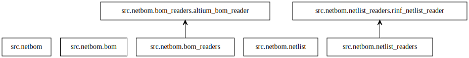

Welcome to netbom's documentation!
==================================

.. include:: ../README.rst
   :start-after: start-intro
   :end-before: end-intro

Provided modules
================

This library is composed of following modules (highest level at the bottom):

.. toctree::
   :maxdepth: 1
   :caption: Modules:

   netlist
   netlist_readers

Indices and tables
==================

* :ref:`genindex`
* :ref:`modindex`
* :ref:`search`
