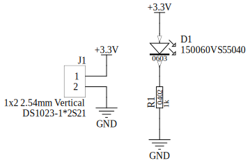
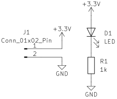

netlist_readers
===============
.. automodule:: netbom.netlist_readers

Parsing RINF Netlist file exported from Altium Designer
-------------------------------------------------------

Schematic in Altium Designer exported to RINF Netlist file (with FRP extension):

Parsing using netbom library:

.. doctest::

   >>> from netbom.netlist_readers import RinfNetlistReader
   >>> import os

   >>> # Importing Altium's RINF Netlist to Netlist and Bom objects
   >>> DIR = os.path.join(os.path.dirname(os.path.abspath(__name__)), 'tests/examples/netlist/')
   >>> bom, netlist = RinfNetlistReader().bom_and_netlist_from_file(DIR + 'Altium_LED-Resistor.FRP')

   >>> # Printing file flavor
   >>> RinfNetlistReader().get_file_flavor(DIR + 'Altium_LED-Resistor.FRP')
   'Protel 2004 Version 1.0.0.30000'

   >>> # Printing imported Netlist object
   >>> print(netlist)
   {'NetD1_1': {'D1': ['1'], 'R1': ['2']}, 'GND': {'J1': ['2'], 'R1': ['1']}, '+3.3V': {'D1': ['2'], 'J1': ['1']}}

   >>> # Printing imported Bom object
   >>> for row in bom.rows:
   ...   print(row['Part Number'])
   OL_G_0603_150060VS55040
   J_HEADER_1x2_2.54_VERTICAL
   R_1k_0402_1

   >>> # Filter netlist by component designator prefix
   >>> filtered_designators = netlist.filter_designator(startswith='R')
   >>> print(filtered_designators)
   {'R1': {'1': 'GND', '2': 'NetD1_1'}}

Parsing RINF Netlist file (CadStar netlist) exported from KiCad
---------------------------------------------------------------

Schematic in KiCad exported to RINF Netlist file (called in KiCad as CadStar netlist, with frp extension):

Parsing using netbom library:

.. doctest::

   >>> from netbom.netlist_readers import RinfNetlistReader
   >>> import os

   >>> # Importing KiCad's RINF Netlist to Netlist and Bom objects
   >>> DIR = os.path.join(os.path.dirname(os.path.abspath(__name__)), 'tests/examples/netlist/')
   >>> bom, netlist = RinfNetlistReader().bom_and_netlist_from_file(DIR + 'KiCad_LED-Resistor.frp')

   >>> # Printing file flavor
   >>> RinfNetlistReader().get_file_flavor(DIR + 'KiCad_LED-Resistor.frp')
   'Eeschema 8.0.0'

   >>> # Printing imported Netlist object
   >>> print(netlist)
   {'Net-(D1-K)': {'D1': ['1'], 'R1': ['1']}, 'GND': {'J1': ['2'], 'R1': ['2']}, '+3.3V': {'D1': ['2'], 'J1': ['1']}}

   >>> # Printing imported Bom object
   >>> for row in bom.rows:
   ...   print(row['Designator'], row['Value'], row['Footprint'], row['Symbol'])
   R1 1k R_0402_1005Metric Resistor_SMD
   D1 LED LED_0603_1608Metric LED_SMD
   J1 Conn_01x02_Pin PinHeader_1x02_P2.54mm_Vertical Connector_PinHeader_2.54mm

Reference
---------

.. autoclass:: netbom.netlist_readers::RinfNetlistReader
   :members:
